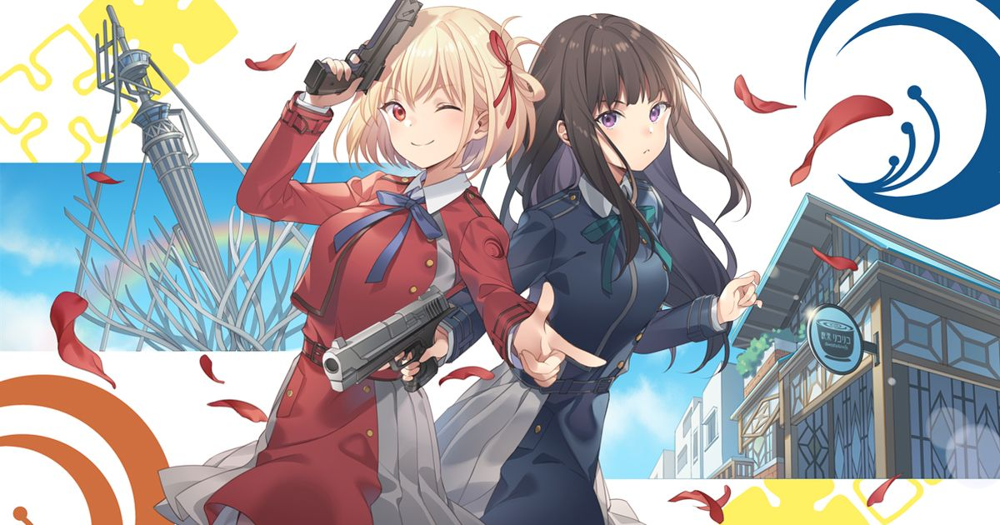

# CUERPO A CUERPO
*Un fanfic de Lycoris Recoil, en diez capítulos*

> *Historia basada en el anime original de Spider Lily y Asaura (A-1 Pictures, 2022). Los personajes pertenecen a sus creadores; la carpa de la adivina y todo desastre derivado de ella, no.*

---

## Capítulo 1 — Todo por la feria

> *"El que ríe último ríe mejor… salvo que ría con la cara equivocada."*
> — Pizarra del Café LycoReco (autoría en disputa: Chisato la escribió, Takina la tachó, volvió a aparecer).

---

Hay cosas que no cambian aunque el mundo se encargue de fingir que sí: el café se muela a las 7:58, las tazas se alinean a 1.5 centímetros del borde de la barra, y en algún rincón de Tokio siempre habrá alguien leyendo una revista de bodas fingiendo que hace inventario.

El Café LycoReco despertaba a esa hora, como todos los días, con la dignidad silenciosa de una casa vieja japonesa convertida en refugio: madera oscura, vitrinas con dorayaki alineados como monedas, el olor compartido del café recién hecho y el dashi, y una pizarra junto a la entrada cuya frase del día decía, en letra redonda y entusiasta:

**"EL LUNES TAMBIÉN ES VIERNES SI TIENES ACTITUD."**

Debajo, en letra pequeña, angular y claramente militar:

*Mentira. — T.*

Y debajo de eso, otra vez en letra redonda:

*La actitud también cree en ti. — C.*

*(Y debajo de eso, ya sin espacio, una flecha furiosa señalando el borrador.)*

Mika calibraba el molino con la solemnidad de un luthier. Mizuki Nakahara, gafas de marco rojo y ojera existencial, hojeaba *DI "SÍ" EN OTOÑO: TENDENCIAS* detrás de la barra, con el teléfono medio escondido bajo la revista. En la pantalla, un perfil de aplicación de citas mostraba a un hombre sonriente identificado como **ABOGADO, 35, HOKKAIDO (TOTALMENTE REAL)**.

—Se ve… estable —murmuró para sus adentros, con la esperanza cautelosa de quien ha escuchado esa palabra usada en demasiados crímenes.

Desde el closet del fondo llegó un gruñido de hibernación. En la puerta del closet colgaba un calcetín con una nota: **NO MOLESTAR (COBRO POR HORA)**. Dentro, Kurumi dormía ovillada entre cables y una consola portátil que parpadeaba en silencio, soñando probablemente con probabilidades de botín legendario.

Los clientes de primera hora ya ocupaban sus sitios de siempre: el señor Yamada con su "lo de siempre" (que nadie recordaba haber confirmado jamás, pero que llegaba puntual), dos estudiantes compartiendo un parfait con ritual de pareja en guerra fría, y un oficinista que leía el periódico con la intensidad de quien esconde un espionaje, aunque solo escondía el sudoku.

Las 7:58 de la mañana son, en definitiva, una hora sagrada en el Café LycoReco.

También es la hora exacta en que Takina Inoue termina de alinear la última taza a 1.5 centímetros del borde de la barra —regla que ella misma redactó, firmó y archivó—, revisa el broche de su mandil beige sobre el samue azul cerúleo, y declara el establecimiento operativo.

—Piso listo. Barra lista. Suministros al noventa y ocho por ciento —informó, a nadie en particular y a todos por igual—. La única anomalía registrada es la ausencia de personal de mostrador.

—Yo cuento como anomalía todos los días —dijo Mizuki sin levantar la vista.

—Tú no cuentas. Eres un riesgo actuarial conocido.

A las 8:23, la puerta se abrió de un empujón escandaloso, la campanilla protestó, y Chisato Nishikigi irrumpió con los brazos en alto, como quien acaba de salvar el mundo o, en su defecto, acaba de conseguir algo mejor.

—¡BUENOS DÍAS, FAMILIA LYCORECO! Hoy es un día histórico. Marquen el calendario. Avísenle a alguien importante.

—Llegas veintitrés minutos tarde —dijo Takina sin levantar la vista de las tazas.

—Veintitrés minutos tarde… *¡y con regalos!* —Chisato desenvainó dos boletos impresos con la solemnidad de un samurái desenvainando su katana, y los dejó sobre la barra como quien presenta pruebas en un juicio de última instancia—. Saori los mandó. Dice que son las gracias por lo del acosador. Dos entradas para Kingdom Paradise. *El* parque de diversiones.

—Vino ella misma a traerlos —añadió—. También mandó esto.

Sobre la barra cayó una foto impresa. Se veía borrosa, ágil, torcida: dos figuras a contraluz saltando un barandal, una rubia riendo con todo el cuerpo y otra de coleta baja apuntando hacia fuera del encuadre, todo tomado evidentemente sin permiso desde una camioneta.

—¿Por qué nos tomó una foto en medio de una operación? —preguntó Takina.

—Porque es fotógrafa.

—Eso no lo justifica.

—Tú salías bien. Yo salía *épica*. Justificadísimo.

Hubo un silencio. Mizuki había bajado la revista de a poco, como una bandera de derrota inminente.

—¿Qué es eso? —preguntó, señalando los boletos.

—¡Un parque de diversiones! Montañas rusas, churros, algodones de azúcar del tamaño de tu cabeza…

—Yo sé lo que es un parque de diversiones —Mizuki apoyó la revista con lentitud dramática—. Lo que pregunto es por qué *ustedes* dos van a uno con entradas regaladas mientras yo me pudro aquí sirviendo café.

—Porque el amor de tu vida podría entrar hoy por esa puerta —dijo Chisato, señalándola con ambas manos.

—…Que conste que te odio, pero que acepto ese argumento. Totalmente. Pueden retirarse.

Takina cruzó los brazos. Su cara hizo lo que su cara siempre hacía ante los planes de Chisato: nada, pero con intención.

—Un parque de diversiones es una inversión de seis a ocho horas con cero retorno táctico. Es ineficiente.

—Es *divertido* —corrigió Chisato.

—Eso dije.

—Es la *misión* de hoy.

—Las misiones tienen objetivos.

—¡El objetivo es divertirse!

—Eso no es un objetivo. No se puede medir.

—Se mide en churros.

Mika se limpió las manos en un paño. Cuando él dejaba el paño sobre el hombro, el café entero sabía que venía sentencia.

—Vayan.

—¿Cómo? —Takina giró la cabeza.

—Orden directa del gerente. Ustedes dos, fuera, a divertirse. Hasta el café necesita aire nuevo de vez en cuando —miró a Takina—, y la gente también, aunque la gente lo niegue por escrito.

—Puedo quedarme de refuerzo —ofreció Takina, con dignidad de soldado apelando la sentencia—. Puedo hacer inventario. Puedo rehacer las rotulaciones de los frascos, que están inconsistentes desde febrero.

—Takina —dijo Mika, con la paciencia de un abuelo y la precisión de un francotirador—. Yo llegué a los cincuenta casado con este café. Ustedes no tienen esa excusa. Vayan ahora que los abrazos todavía caben en un carrusel.

Nadie supo muy bien qué quiso decir con eso, pero a Mika se le perdona la poesía porque prepara el mejor café del barrio.

—¿Y el café? —insistió Takina, acorralada, buscando asideros protocolarios.

—Mizuki, Kurumi y yo podemos.

—¡¿Cómo que "podemos"?! —protestó Mizuki.

—Cobran por hora —llegó la voz dormida de Kurumi desde el closet, clara como si estuviera despierta, porque hablaba dormida igual de claro que despierta—. Y llévenme un peluche. El más feo que tengan. Quiero que intimide.

—¡Anotado! —Chisato saludó con la mano hacia el closet.

—No pienso traer nada —dijo Takina.

Traería el peluche más feo del parque, claro. Pero eso lo supimos después.

---

Takina llegó a la estación con un documento. Un documento *laminado*.

**PLAN DE RECREACIÓN ÓPTIMA — KINGDOM PARADISE (rev. 3.1)**

09:00 Abordar tren.
09:27 Llegada a destino.
09:30–09:32 Asombro general.
09:33 Atracción 1: Dragon Loop (evaluación estructural incluida).
10:15 Atracción 2.
11:00 Hidratación programada.
12:00 Almuerzo (30 min).
12:30 El almuerzo termina en punto.
12:31 Negación del postre.

—¿"Asombro general" tiene horario? —preguntó Chisato, leyendo por encima de su hombro.

—Dos minutos. Es suficiente.

—¿Y "negación del postre" es una actividad?

—Es una política.

Chisato tomó el plan con dos dedos, lo dobló con la destreza de una profesional del papel y lo lanzó en forma de avión directo al cesto de basura del andén.

Entró. Claro que entró. Esa maldita puntería.

—Improvisación general —anunció—. Todo el día. Es la rev. 1.0 y ya viene firmada.

—Eso no es un plan.

—Es el mejor plan que hago en años.

El tren llegó con su bocina educada y sus asientos imposibles, y durante los veintisiete minutos de trayecto ocurrió algo que Takina Inoue debió prever: encerrada en un vagón con Chisato Nishikigi, la conversación era un recurso natural inagotable.

—Ves a ese señor —dijo Chisato, sin bajar apenas la voz—. Paraguas en la mano izquierda, callos de raqueta en la derecha, cara de funeral. Juega tenis todos los sábados. Lo odia. Se lo exige su cuñado y hoy le va a decir que no. Mira el mentón: es la cara de un hombre que ensayó la frase en la ducha.

—Imposible comprobarlo —dijo Takina.

—A la de morado le huele la bolsa a panadería, pero compró todo con etiquetas de descuento: hornea en casa y finge que compra. Nivel siete de ‘qué dirán'.

—Chisato.

—El niño de la gorra esconde un desarmador en la mochila, su hermana lo sabe y lo está engomiendo con la mirada… y allá va: le quitó la tapa al dispensador de boletos en la mente, lo cual cuenta.

—Para.

Takina se acomodó en el asiento con los brazos cruzados.

—Tú haces eso siempre.

—¿El qué?

—Leer a la gente. Los músculos. Las manos. Lo que nadie te contó. —Lo dijo como quien enumera irregularidades en una tela—. Es agotador de ver.

—Es entretenido de hacer —Chisato sonrió de lado—. Yo lo hago para quererlos, ¿sabes? Si los entiendo, luego me caen bien solos.

Hubo una pausa brevísima, de esas que en los trenes se rellenan con el traqueteo.

—La salida de emergencia está a dos metros —dijo Takina entonces—. La señora de morado sería un obstáculo menor. El niño de la gorra, un cómplice potencial. Tu ventana refleja al cuarenta por ciento del vagón: los vigilas de reojo desde que subimos. Tú también lo haces, Chisato.

—Ajá, ¿y qué aparento yo, detective?

Takina la miró un segundo, de arriba abajo, con la frialdad de un letrero de prohibido fumar.

—Problemas.

—¡Gracias! —dijo Chisato, y se rio como si le hubieran hecho un regalo, porque en cierto modo era eso.

---

Kingdom Paradise las recibió a las 9:30 en punto —Chisato hizo notar, con respeto profesional, que el asombro general sí empezó a horario— con música de corneta, olor a churro y una noria del tamaño de una decisión vital. En la entrada, una mascota gigante con corona torcida saludaba a los niños con entusiasmo de político: Reythur, el Rey Mollete, emblema del parque y probablemente peligro para la navegación en espacios cerrados.

Chisato chocó las cinco con el rey. Takina, por reflejo, lo escaneó de la corona a las suelas.

—¿Qué *haces*? —preguntó Chisato.

—Verificando. Ese traje reduce la visión periférica en ochenta por ciento. No deberían dejarlo cerca de fuentes.

—Takina.

—Ahora sé eso sobre el rey. No puedo no saberlo.

A las 9:47, ya había una fila de niños señalando a Chisato, que caminaba con un algodón de azúcar del tamaño exacto de su cabeza, tal como prometían el folleto y la tradición. Takina iba a su lado con la media cola en ristre, postura de desfile militar y una bolsa de senbei comprada en el primer puesto disponible.

—Los compraste a la entrada —observó Chisato.

—Para no tener que volver después —dijo Takina, mordiendo uno con solemnidad de ración de campaña—. Previsión logística.

—Estás comiendo galleta a las 9:47 de la mañana en un parque de diversiones.

—Los senbei no conocen horarios. Los horarios los conocen a ellos.

Chisato decidió que aquella frase merecía la pizarra del café. Ya la veríamos ahí, con flecha furiosa incluida.

La primera atracción fue la montaña rusa *Dragon Loop*: tres inversiones, un descenso de ochenta metros y un cartel que juraba estar "certificado por expertos y temido por abuelas". En la fila, Chisato contemplaba la estructura con el cuello estirado y los ojos brillantes de quien lee el futuro en los rieles; Takina lo hacía también, solo que el suyo era otro tipo de lectura.

—Análisis —exigió Chisato, ya sentadas, con la barra de seguridad bajada.

—Estructura de acero con fatiga regular visible en las soldaduras del tramo cuatro, tornillos reemplazados hace menos de un año, operador atento, cinturones en buen estado, mantenimiento reciente —enumeró Takina—. Aprobado.

—Nadie te preguntó.

—Alguien tiene que preguntarlo todo.

El descenso principal duró nueve segundos.

Nueve segundos en los que Chisato gritó con los brazos en cruz como un ave emocional, entregada al vértigo como otros se entregan a la música, y Takina calló con la dignidad de quien no negocia con la gravedad. Pero en la inversión tres —cuando el mundo se volvió un lazo de cielo y rieles y la cartera de alguien decidió explorar la ingravidez—, su boca dibujó algo que no era una mueca.

Lo atestiguó la foto oficial de la atracción, disponible en la cabina de salida por 800 yenes.

—No vamos a comprar eso —dijo Takina.

—¡Claro que sí! Mira tu cara.

—Por eso. Hay que destruirla. Es evidencia.

—Ochocientos yenes por prueba incriminatoria —calculó Chisato, sacando monedas—. Barato.

Adquirieron, pues, la evidencia. En la foto quedó para la historia universal lo siguiente: Chisato como cometa humana, Takina evaluando soldaduras con el alma, y en el rinconcito inferior de la imagen, ambas compartiendo, sin saberlo, exactamente el mismo segundo.

Chisato consiguió después otra copia "para el café". Takina fingió no escuchar la parte donde fingió pedirla en serio.

En el puesto de tiro, el encargado cometió el error de sonreír con condescendencia.

—Cinco disparos, tres blancos, y el premio grande es suyo, jovencita.

Takina tomó el rifle de feria, lo sopesó una vez, palpó la mira deliberadamente desalineada, calculó la desviación exacta en menos de dos segundos… y procedió a tumbar quince blancos seguidos con cinco disparos, rebotando balines en postes, en latas y en el propio orgullo del establecimiento. El último balín realizó una parábola innecesaria, hermosa y humillante antes de derribar la pirámide de botellas numéricas en orden descendente.

—¿Ejército? —tartamudeó el hombre—. ¿Policía? ¿…Deuda pendiente conmigo, jovencita?

—Campamento escolar —mintió Takina, que mentía con el mismo entusiasmo con que emocionaba: ninguno.

—El premio grande —dijo Chisato, ya inclinada sobre el mostrador de los peluches, evaluándolos con los criterios de siempre, que eran dos: potencial de abrazo y potencial de fealdad—. Ese. El verde.

Era un peluche verde con un solo ojo, expresión de impuesto sin pagar y una oreja visiblemente cosida por alguien en duelo.

—¿Estás segura? —preguntó el encargado, por piedad.

—Jamás he estado más segura de algo. Tiene cara de asumir responsabilidades. —Chisato lo abrazó con solemnidad—. Se llamará Presidente Mofletes.

—…Aprobado —concedió Takina, y eso, viniendo de ella, era un discurso de aceptación con banda presidencial.

En los carritos chocones ocurrió lo inevitable. Veinte personas entraron a la pista; veinte personas descubrieron que existen dos clases de seres humanos. Chisato, a quien nadie embistió ni una vez —se deslizaba entre choques como si los carritos se avisaran entre ellos por telégrafo, derrapando a un centímetro de cada catástrofe con una sonrisa de anuncio de pasta dental—, y Takina, que ejecutó maniobras de pinza, bloqueos laterales y emboscadas desde los ángulos muertos con precisión de manual de guerra psicológica, hasta que tres niños, liderados por uno de carrito azul y cara de estadista, formaron una alianza militar en su contra.

Perdieron con honra. Takina estrechó la mano de cada uno después, muy seria, de igual a igual.

—Soldado —le dijo al del carrito azul.

El niño lloró de orgullo. Su madre preguntó después, bajito, si aquellas dos eran "de algún programa de talentos". Sip. Algo así.

La Mansión del Samurái Sin Cabeza era la atracción de terror oficial del parque: pasillos angostos, humo de catálogo y actores con velos que saltaban de los armarios gritando "¡mi cabeza!" con sincronización variable.

Duró exactamente cuatro minutos de paz.

En el minuto cinco, Chisato ya se había hecho amiga de tres fantasmas.

—¡Ese efecto de humo está hermoso! —le dijo al primero, que salió del armario y encontró una cliente inspeccionándole el disfraz con los brazos en jarras—. ¿Lo hacen con glicerina? ¿Tú lo haces con glicerina? Se nota, quedó espectacular.

El fantasma, contra toda su formación, dijo "gracias".

Takina, por su parte, había entrado al pasillo como quien limpia un edificio: barrió la primera esquina, cortó el pastel de la puerta siguiente, inmovilizó al segundo fantasma contra la pared con la muñeca en llave antes de que el pobre hombre terminara de gritar lo de la cabeza, y para el tercer cuarto ya había localizado la caja de breakers del set ("las luces de emergencia están cubiertas por un telón; eso es una violación al reglamento", informó, y procedió a dejarlo mejor que como lo encontró).

El actor principal —el samurái decapitado en persona— se encontró, por primera vez en su carrera, sin saber si asustar o pedirles un autógrafo: la rubia le aplaudía y le regalaba consejos de actuación ("¡grita desde el diafragma, así no te lastimas la garganta!") mientras la de negro le reorganizaba el campo de operaciones del pasillo ("si te colocas en diagonal al punto ciego de la entrada, duplicas el susto sin gastar más presupuesto; de nada").

A la salida, el personal les dedicó una encuesta espontánea de una sola pregunta: ¿qué eran? Chisato respondió "entusiastas". Takina respondió "clientes". El samurái votó, internamente, "las mejores y las peores al mismo tiempo", y se sintió un mejor actor después, aunque no supo explicar por qué.

Frente a la fuente de los delfines —una glorieta con chorros de agua y tres delfines de piedra saltando en arco eterno—, Chisato se detuvo con la solemnidad que le reservaba a sus ideas terribles.

—Takina. Mira. Anguila de jardín.

Y, sin más, apoyó las palmas una contra otra, las estiró frente a su cara entre dos chorros de agua, alzó la barbilla y se contoneó con una voz de placard:

—*Chinanaaago.*

La gente a su alrededor no se dio cuenta de nada. Takina se dio cuenta de absolutamente todo.

—No —dijo.

—Venga, tú sabes que te encanta.

—Nunca, jamás, bajo tortura, en tiempo de paz o de guerra, en esta dimensión ni en las vecinas.

—Hasta Kurumi lo hizo.

—Kurumi no existe. Es un mito urbano con ping alto.

Diez minutos después —la evidencia es terca—, junto a la misma fuente, ocurrió un incidente sin testigos oficiales. Una niña pequeña, admiradora instantánea de la señorita de pelo largo, preguntó si esa "posea de pececito" del dibujo del mapa se podía hacer de verdad. Takina miró a un lado, miró al otro, no calculó correctamente la ubicación de su compañera (error histórico), juntó las manos al frente, alzó una piernita con coreografía de ángel caído y murmuró, con la dignidad de un ritual antiguo:

—*Sakanaa.*

La niña aplaudió como si le hubieran devuelto un globo. Desde algún lugar detrás de un puesto de churros, Chisato presenció la escena con los ojos del tamaño de los platillos, el alma en reposo absoluto y la decisión firme de no decir jamás una sola palabra.

Iba a guardarlo como quien guarda, no sé, un protocolo de emergencia. Un tesoro. Un oxímoron con piernas.

—¿Pasa algo? —preguntó Takina al volver, con el ceño preparado.

—Nada —dijo Chisato, con la sonrisa más honesta del oeste de Tokio—. Nada en absoluto. Es, con diferencia, el mejor día de mi vida.

Comieron sobre la una, o a la hora exacta en que la torre de churros de Chisato alcanzó los cinco pisos y empezó a violar dos leyes de la física y una ordenanza municipal. Takina la observó con la libreta mental del comité de presupuestos.

—Cuatro mil setecientos yenes en juegos, hasta el momento —informó—. Mil doscientos en algodón. Ochocientos en una foto que vamos a quemar.

—Mil doscientos en algodón —repitió Chisato, feliz, afirmando con la boca rodeada de churro—. ¿Sabes qué haría sin ti? Alguien tiene que llevar las cuentas del desastre.

—Alguien tiene que evitar el desastre en primer lugar.

—Esa persona no la invitan a las fiestas.

—Esa persona financia las fiestas.

Chisato contempló aquello con respeto, cogió otro churro, y sin dejar de masticar mantuvo un debate de tres minutos —que perdió— sobre si la torre necesitaba un sexto piso "por cuestiones de fe". Takina cedió exactamente un (1) churro adicional y anotó la cifra en un libro de contabilidad que nadie le había pedido y que, por supuesto, era impecable.

En algún momento, sin que ninguna de las dos lo dijera, ocurrió algo extraño: el plan había muerto a las 9:31 de la mañana, y el mundo no se había acabado. Takina lo registró en la libreta, al final de la página, con letra pequeña:

*Pendiente: averiguar cómo es posible.*

En la cabina de fotos —ese cubículo donde el tiempo se comporta de forma sospechosa— acordaron tomarse cinco fotos "para el archivo", que era la manera que tenía Takina de decir "por favor" sin que se notara la acentuación. Resultado, en orden:

1. Chisato haciendo la cara de marciano recién descendido; Takina mirándola como si la estuviera identificando en una rueda de reconocimiento.
2. Chisato inflando los cachetes; Takina con cara de asamblea de condominio.
3. Chisato abrazando al Presidente Mofletes; Takina sosteniendo con dos dedos, como evidencia, la esquina del peluche para no tocarlo del todo.
4. Chisato haciendo la paz con una cara tan seria que parecía un homenaje a Takina; Takina, por cortesía, hizo una sonrisa que parecía un aviso legal. Ambas pidieron repetir la foto. Les fue negado por el futuro.
5. Sin que nadie lo planeara, se miraron entre ellas, sorprendidas a mitad de la risa, y en la foto quedó ese instante exacto en que las dos estaban de acuerdo en algo sin comprobarlo: que el día había valido completamente la pena.

—Esa hay que destruirla —dijo Takina, como quien ofrece un brindis.

—Esa hay que *enmarcarla* —dijo Chisato, ya guardándose una copia en el bolsillo con velocidad de carterista—. Las dos.

Takina conservó la suya. "Para análisis de seguridad", explicó, sin explicar jamás nada más, y se la guardó tan al fondo de la cartera que le tomó a Chisato tres estaciones de metro no notarle la sonrisa que le duró toda la tarde.

Fue, en resumen, el mejor día libre que Takina Inoue no admitiría jamás haber tenido. Como ella misma lo había planeado sin saberlo en la rev. 3.1 de su propia vida, esto duró hasta las 17:42.

A las 17:42 encontraron la carpa.

---

No estaba en el folleto. Eso lo notó Takina primero: su cerebro de archivador mental llevaba la cuenta de todas las atracciones, y entre el tren fantasma y el puesto de yakitori el mapa oficial no registraba *nada*. Sin embargo, ahí estaba: una carpa circular de rayas moradas y plateadas, con una fila de focos que parpadeaban en desacuerdo con la música ambiental del parque y un letrero escrito a mano con letra de farmacia antigua:

**MADAME AURORA — VIDENTE**
*Su futuro, con precio justo. Se aceptan monedas y preguntas incómodas.*

—No estaba aquí esta mañana —dijo Takina.

—Está aquí ahora —dijo Chisato, y eso fue, como casi todo en Chisato, inobjetable y encantador.

—El folleto no la registra. La estructura es demasiado liviana para un permiso estatal. Podría ser un puesto no autorizado.

—¡Entonces es *clandestino*! Mejor todavía.

—Eso no es como funciona la clandesti— ¿me estás escuchando? No me estás escuchando. Ya entraste.

Chisato ya había levantado la lona de entrada.

Dentro, el mundo exterior se apagó un grado, como cuando cierras una puerta vieja. Olía a incienso barato y a feria cara; guirnaldas de luces moradas colgaban de un techo imposible de alto (¿o era fácil? Después no coincidirían en este dato); un hule estampado de galaxias cubría la mesa redonda del centro, y sobre la mesa, una bola de cristal que, a juicio profesional de Takina, parecía comprada por catálogo en la sección *ocultismo, ofertas de temporada*.

Detrás de la mesa, una mujer de edad inasible —cuarenta, sesenta, mil años según el ángulo de la luz— con turbante de lunas bordadas y la sonrisa de quien ya vio la película hasta el final y no piensa spoilear nada, barajaba un mazo de cartas con dedos de pianista.

—Ah —dijo Madame Aurora antes de que hablaran—. Puntuales. Tomen asiento.

—No teníamos cita —dijo Takina, que había adoptado la postura de la gente que calcula salidas de emergencia (dos, si contaba rasgar la lona trasera).

—El destino nunca tiene cita, y aun así llega —la mujer dejó caer las cartas en abanico—. Siéntense, queridas. La primera lectura incluye un susto gratis.

—¿Y luego cobra? —Chisato ya se había sentado, encantada con el espectáculo.

—Luego cobro el susto también. Soy vidente, no santa.

A regañadientes, con el gesto de quien se acomoda para un interrogatorio, Takina ocupó la silla de enfrente. Cruzó las piernas. Descruzó las piernas. Adoptó la postura oficial conocida en ciertos círculos como “conferencia de prensa del ministerio”.

—Adelante —concedió.

Madame Aurora tomó primero su mano. La volteó. La estudió medio segundo con aire de revisor de billetes. Alzó una ceja.

—Tu línea del destino está trazada con regla —dijo—. Qué raro. Todo recto, todo medido. Presupuestas hasta la felicidad, ¿verdad?

—Uso responsable de recursos —respondió Takina.

—Tus tres sonrisas del mes ya se gastaron —siguió la vidente, trazando la palma con la uña—. A partir de *mañana*, cualquier sonrisa que hagas será financiada con deuda.

—Las sonrisas no se financian.

—Ya lo verás, cielo. Ya lo verás. —Le soltó la mano con suavidad y entonces, sin levantar la voz, añadió como quien añade el dinero exacto en la maquinita—: Dile a tu rehén que fue un buen disparo. Veintidós segundos de desobediencia. Buen criterio.

Takina se quedó inmóvil.

—¿Cómo—?

—Soy muy vidente —dijo Madame Aurora, ya vuelta hacia Chisato, con un destello en las pupilas que no era, definitivamente, del catálogo—. ¿La niña de la otra mano? A ver, muéstramela, valiente.

Chisato extendió la mano con la emoción de una niña en Navidad. Madame Aurora la tomó, la sopesó como quien sopesa una fruta dulce… y algo sucedió: lo teatral se le apagó en la cara un instante, como cuando a una vela le da un aire raro. Miró la palma. Miró a Chisato. Volvió a la palma.

—Tu línea de la vida… —murmuró— no existe.

—Lo siento, ¿cómo que no existe? —sonrió Chisato. Su sonrisa hizo algo peor que caerse: se volvió *exacta*.

—No, espera —inclinó la cabeza, como quien escucha un eco—. No es que no exista. Es que es… prestada. —Alzó los ojos, y por primera vez no sonreía con teatro, sino con respeto—. Joven, ¿quién te regaló la vida?

La carpa se quedó muy quieta.

—A ella no la comentes —dijo Takina, tan bajo que sonó a orden.

—La quiero comentada —dijo Chisato al mismo tiempo, al mismo tono.

Madame Aurora las miró a ambas, palmeó el aire con la mano libre, y la luz de la carpa pareció, por un segundo, acomodarse.

—Muy bien, muy bien. Entonces solo el pronóstico, como en televisión: mañana procura no asustarte, valiente. Tu corazón podría… apresurarse. Sería una novedad, ¿no?

—¿Mañana? ¿Por qué *mañana*?

—Porque algo enorme está por ocurrir en sus vidas. Algo que lo cambiará *todo*. —Alzó un dedo, con solemnidad de anuncio de supermercado—. Cuando llegue, no luchen contra él. Y no busquen espejos: busquen ventanas. Los espejos solo devuelven; las ventanas dejan ver al otro lado.

—Eso suena a letra de canción —comentó Chisato.

—Cuando lo vivas, sonará a manual de instrucciones —Madame Aurora juntó las cartas, las encuadró con dos golpecitos y declaró—: Serán ochocientos yenes.

—¿Tan caro es mi futuro?

—Tuyo está en oferta este mes. —Los ojos de la vidente brincaron de una a otra—. Además, hoy hay promoción de parejas: quinientos las dos.

—NO SOMOS PAREJA —informó Takina.

—¡Tomamos la promo! —informó Chisato simultáneamente, deslizando las monedas sobre la galaxia.

—Sabia decisión —Madame Aurora embolsó el dinero y depositó sobre la mesa dos caramelos envueltos en celofán plateado—. De cortesía. Dulces del destino: ácidos por fuera, dulces por dentro. Como algunas personas que conozco.

Takina examinó el suyo a contraluz con desconfianza profesional, buscando señales de adulteración, taras o violaciones sanitarias. No encontró nada. Chisato se lo echó a la boca antes de que terminara la frase, con una fe en la humanidad que ningún análisis de laboratorio habría respaldado.

—¡Ácido *y* dulce! —confirmó, estrujando el cachete con la mano—. ¡Es cierto!

Takina, penosamente, abrió la cartera con la tapa de la suya ya desenvuelta a medio camino. Se la comió en el pasillo del tren, veinte minutos después, cuando creyó que nadie la miraba. Chisato la miraba. No dijo nada. Milagros existen.

Ya en la salida de la carpa, con su luz violeta apagándose a sus espaldas más rápido de lo cortés, Madame Aurora las despidió con un consejo suelto, de esos que se dan como si no importaran:

—Y si vuelven —no digo que vayan a volver; el destino es terco—, tráiganme galletas de arroz. Las de algas.

—¿Cómo sabe que a mí…? —empezó Takina.

Pero la vidente ya le hablaba al aire, al humo del incienso, a nadie. Cuando Chisato miró hacia atrás, a los diez pasos, la fila de focos de la carpa estaba apagada, aunque ella juraría que seguía oyendo una musiquita.

—Yo digo que era buena —sentenció Chisato, caminando hacia la salida.

—Yo digo que nos investigó en redes sociales —sentenció Takina.

—¿Qué red social revela tu número de sonrisas mensual?

Takina no contestó. Contó mentalmente sus sonrisas del mes. Salían tres. Detestó lo precisa que era la gente extraña.

---

En la fila de salida, bajo la noria gigante encendida como un brazalete, fue donde pasó lo otro.

Empezó con una tontería: el gasto del día. Takina había llevado, por supuesto, una hoja mental de balance. Chisato, por supuesto, la había violado con alegría durante ocho horas seguidas.

—Cuatro mil setecientos en juegos —enumeró Takina—. Mil doscientos en algodón. Ochocientos en una vidente no registrada. Trescientos en una torre de churros estructuralmente inestable. Y ochenta en un avión de papel judicialmente perdido.

—Fue un *día perfecto* —replicó Chisato—. No puedes ponerle precio a esto.

—Puedo ponerle precio a todo. Es mi trabajo. —La noria giró arriba, dócil, ajena—. Tú lo tienes fácil, ¿sabes? Llegas, sonríes, gastas, y todo el mundo te perdona porque eres *tú*. Nadie te exige nada si ya llevas puesta la sonrisa correcta.

La risa de Chisato salió con aristas.

—¿Fácil? Ajá. Claro. Porque cargar con la sonrisa de todo el café todos los días, resolver los casos de todos, y que si algo sale mal tres pares de ojos busquen primero mi cara… eso es facilísimo. Tú sí que la tienes fácil: te escondes detrás de tu regla y media y de tu cara de candado, y nadie espera nada más de ti que "funciones". Nadie te pide que *sonrías*, Takina. Nadie te pide que estés bien siquiera. Solo que *sirvas*.

Hubo un silencio de parque cerrando.

La música de la noria llegaba ya como de otro barrio. En el kiosco de churros del extremo, algún empleado empezaba a bajar la cortina metálica con ese sonido de cierre general que tienen los días perfectos.

—Ojalá tuvieras que vivir UN día siendo yo —dijo Takina.

—¡Ojalá TÚ tuvieras que vivir un día siendo yo! —replicó Chisato.

Lo dijeron al mismo tiempo. Mala suerte, mala coordinación, o precisamente buena coordinación, según como se mire.

El aire supo de pronto a caramelo.

Fue un sabor absurdo, imposible: ácido por fuera, dulce por dentro. Las luces de la noria parpadearon una vez, dos veces, y en alguna parte del parque una máquina emitió un *ding* redondo y feliz, como un microondas anunciando que el destino ya estaba listo.

—¿Escuchaste eso? —preguntó Chisato.

—El sistema de sonido del parque —dijo Takina, mirando hacia arriba—. Nada anómalo.

Lo fue. Pero los filtros de seguridad geniales tienen, a veces, horarios de oficina.

Se fueron cada una por su lado de la acera, lo cual requirió cierta maña, porque la acera era una sola. Chisato llegó a su departamento dando portazos suaves (ella no sabía dar portazos fuertes a su propia casa; le daba pena la puerta), se preparó una merienda de supervivencia a base de helado y una película de acción que comentó en voz alta a un sofá vacío, y se durmió a medio chiste. Takina llegó al suyo a paso marcial, sirvió té frío en una taza correcta, tachó en una lista mental el rubro "día libre" con la frase "cumplido, a regañadientes, con resultados mixtos", y se durmió gastando presupuesto extra de seriedad en no admitir que había disfrutado el carrusel en modo figurado.

Las dos se durmieron molestas, convencidas de haber ganado la discusión.

Ninguna de las dos, en toda la noche, miró hacia el envoltorio plateado del caramelo que brillaba, muy despacio, sobre su buró, como una luciérnaga educada esperando su turno.

---

A las 5:59 a.m., el cuerpo de Takina Inoue se sentó solo en la cama.

—Qué obediente —pensó la mente adormilada que lo habitaba, estirando los brazos como un gato en horario de oficina—. ¿Desde cuándo tengo el sueño tan… puntual?

Un metro y medio de cabello negro se desplomó hacia adelante como una avalancha con estilista. El pelo ajeno tenía, notó, la textura de un abrigo de lujo y el peso de un castigo bíblico. Se lo apartó con las dos manos, tropezó con las puntas a la altura de la cintura —¿quién tiene el pelo TAN largo, por qué, para *qué*, cómo se lava esto sin derrumbar un edificio?— y se miró las manos.

Eran las manos de alguien que nunca ha hecho una broma: dedos largos, un raspón rosado cicatrizándose en el pulgar izquierdo, uñas recortadas a la medida exacta de una ficha técnica.

—Qué manos tan *serias* —dijo ella, y su voz tampoco era su voz: era una voz baja, cortante, preciosa y horrorizada, la voz de una biblioteca con alfileres.

Se plantó frente al espejo del baño. El espejo le devolvió a Takina Inoue en franelas y calcetines, con los ojos violeta muy abiertos y el pelo en estado de juicio final.

—Buenos días —saludó, por probar.

La Takina del espejo pareció anunciar el fin de una era.

Ensayó la sonrisa póster —esa que le salía sola en la entrada del café, la de campanilla y sol de mañana— y el resultado asustó legalmente: el rostro en el espejo curvó la boca sin levantar las comisuras, produjo una especie de anuncio de segunda hipoteca, y le dedicó una mirada de venganza federal. Probó la risilla de la victoria. El espejo le mostró a una villana de novela histórica planeando un funeral ajeno. Probó, por último, su expresión "todo está bajo control".

Cuatro testigos silenciosos se salvaron esa mañana de una demanda colectiva.

—Órale —dijo Chisato Nishikigi, cruzándose de brazos frente a su propia cara ajena—. Así que así me veía… ¿qué?

---

A ocho kilómetros de distancia, Takina despertó con pelo en la boca.

Rubio. Pelo rubio, corto, con un mechón atado con una cinta roja que le rozaba la mejilla con la familiaridad insolente de una mascota. Se lo sacó de la boca con cautela forense. Se tocó la cara con más cautela forense. La cara le sonrió de vuelta.

Ella no estaba sonriendo. Ese era el problema. La cara sonreía *sola*, como un engranaje echado a andar al encender la máquina, como si los músculos de ese rostro vinieran de fábrica ajustados a "fiesta de cumpleaños".

—Esto es un secuestro —informó Takina a la habitación vacía—. De mi cara.

Intentó poner "cara seria". La cara asintió amablemente y siguió en modo "aportemos alegría al mundo". Subió los extremos hacia abajo con los dedos, en plan intervención quirúrgica; al soltar, rebotaba hacia arriba como un toldo de tienda. Descubrió, con creciente consternación administrativa, que la cara de Chisato Nishikigi era un electrodoméstico con un solo botón, y que el botón era **ENCENDIDO**.

Se llevó la mano al pecho, por instinto, buscando un pulso que la espantara de vuelta a la cordura.

Silencio.

Nadie en su sano juicio debería aceptar el silencio donde debe latir un corazón.

—Me morí —concluyó. Luego: un destello de memoria, un hospital, un anciano en máquina de asistencia y una revelación al oído. —Espera. No. Ya estaba así. Es *ella* la que está así. —Pausa larga—. SIGUE SIENDO INACEPTABLE, CHISATO.

Exploró el terreno con la disciplina de una profesional. El apartamento era un crimen de lesa organización: tazas acumuladas en torres urbanas, un mando de videojuegos reposando en una cafetera, tangos de ropa colgada de estructuras no homologadas para tales fines, y, en el sofá, una almohada con forma de dona y manchas de dona real. Había tres pares de zapatos distintos junto a la puerta, todos a la mitad del camino hacia el vacío. En la pared, enmarcada con cariño y torcida con negligencia, la foto borrosa de dos figuras saltando un barandal, y junto a ella, una tira de fotos de cabina en la que una niña de pelo largo intentaba no parecer que sonreía.

Takina apartó la vista de aquella foto con más dificultad de la que sus manuales aconsejaban.

Se miró al espejo. El espejo devolvió a Chisato Nishikigi con la cinta roja torcida a las seis de la mañana, la camiseta pijama arrugada y esa sonrisa *que no se apagaba*.

—Bien —dijo Takina, señalando su reflejo con la severidad de un cabo instructor—. Escúchame con atención. Eres una infiltrada. Misión: localizar a la responsable, revertir la situación, y redactar un informe. Quiero disciplina. Quiero orden. Quiero que esa cara deje de sonreír.

El espejo, contra toda evidencia óptica, solo sonrió un poquito más.

El grito de Chisato y el grito de Takina salieron de sus respectivas gargantas prestadas a la misma hora, a ocho kilómetros de distancia, y despertaron a la misma ciudad desprevenida. Acto seguido, los dos teléfonos se encendieron a la vez: cada una estaba llamando a la otra.

Las dos llamadas chocaron en el aire y se devolvieron con tono de ocupado.

—¿Por qué está ocupada? —se preguntaron ambas, con acentos distintos, con la misma cara de espanto.

Y en un parque de diversiones ya cerrado, entre el tren fantasma y el puesto de yakitori, una carpa de rayas moradas que oficialmente jamás existió comenzó a recogerse sola, doblándose en cuatro, muy despacito, con el cuidado de quien ya terminó su trabajo.

---

**FIN DEL CAPÍTULO 1**

*En el próximo capítulo: pruebas, pistas y una nota pegada en una puerta que no existe. No hay manual para esto.*

**MENÚ DE HOY:** torre de churros (violación de la física), senbei de algas (racionados), dulce del destino (agotado para siempre).
